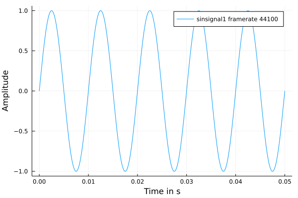
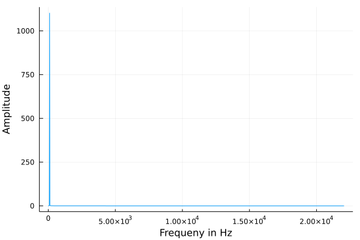
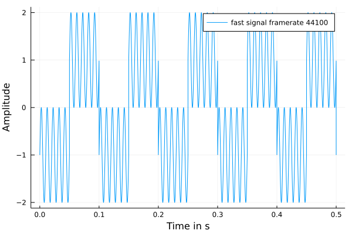
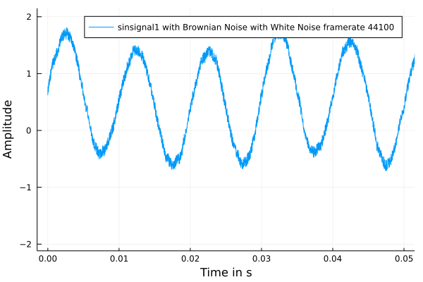

# ThinkDSP

You can install the package with the package manager just like

```julia
import Pkg
Pkg.add("https://github.com/sz73/ThinkDSP.jl") 
```

or via the REPL in the package manager mode, accessible through the closing bracket ']'

```julia
(EnvironmentName) pkg > add https://github.com/sz73/ThinkDSP.jl
```


Functionality:

Three Structs: 

    - Signal
    - Wave 
    - Spectrum

One can construct a signal after importing the package.

```julia
using ThinkDSP
signal1 = Signal(freq=100,amp=1,offset=0,f=sin,name="sinsignal1")
```
Inspecting is made easy, using the Latexfiy package, latexifying the signal. An additional call of the `render()`-function might be necessary when not working in a Jupyter Notebook.

```julia
using Latexify
latexify(signal1)
```

𝑠𝑖𝑛𝑠𝑖𝑔𝑛𝑎𝑙(𝑡)=𝑠𝑖𝑛(2π100(𝑡+0𝑠))·1


Creating a wave object with default behavior such that the wave includes 5 periods of the lowest frequency contained in the signal, as a signal can consist of multiple frequencies, amplitudes, functions, and offsets.

```julia
wave1 = Wave(signal1)
```

Plotting functionality is provided by Plot recipes, i.e. plotting a wave is straightforward.

```julia
using Plots
plot(wave1)
```



One can switch between Wave (time space) and Spectrum (frequency space) through calling a constructor on a object.

```julia
spectrum1 = Spectrum(wave1)
wave11 = Wave(spectrum1)

isapprox(wave1.amps, wave11.amps) # true
```

A spectrum can also be plotted


```julia
plot(spectrum1)
```



Mixing Signals

Two created Signals can be mixed by adding them

```julia
signal2 = Signal(freq=10,amp=1,name="slow signal", f=squarewave)
signal3 = Signal(freq=100,amp=1,name="fast signal", f=sin)

signal_mixed = signal2 + signal3

plot(signal_mixed |> Wave)
```




## Noise

There are four different noise structs

- White Noise
- Gaussian Noise (Uniform Uncorrelated Noise)
- Brownian Noise
- Pink Noise

They can be evaluated on its own or can be added to signals and waves.

```julia
wave_noise = Wave(signal1 + BrownianNoise(1) + WhiteNoise(0.1)  ) 

plot(wave_noise)
```


To get a better understanding of the effects of the noise we can also hear the resulting wave


```julia
using WAV

wavplay(wave_noise)
```


